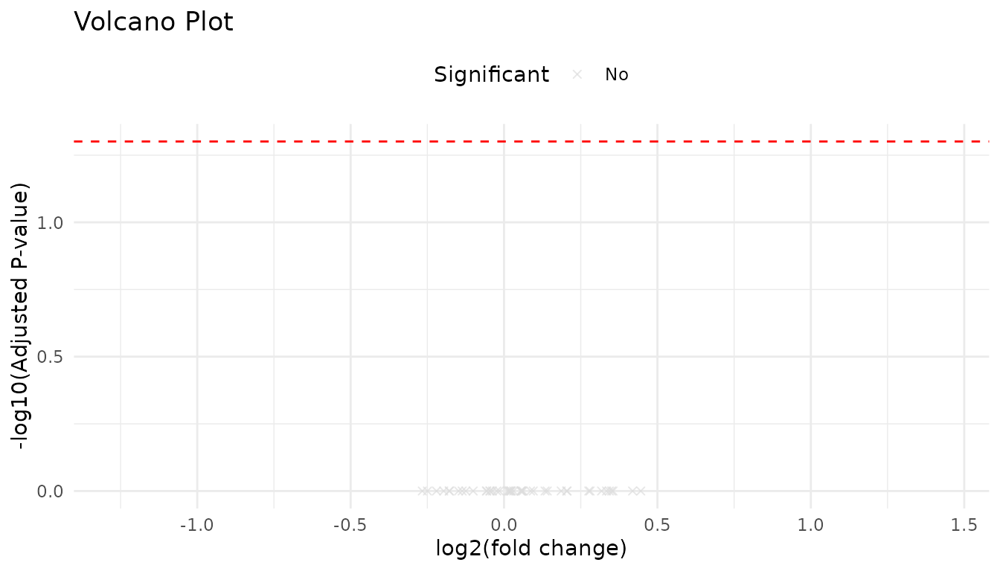
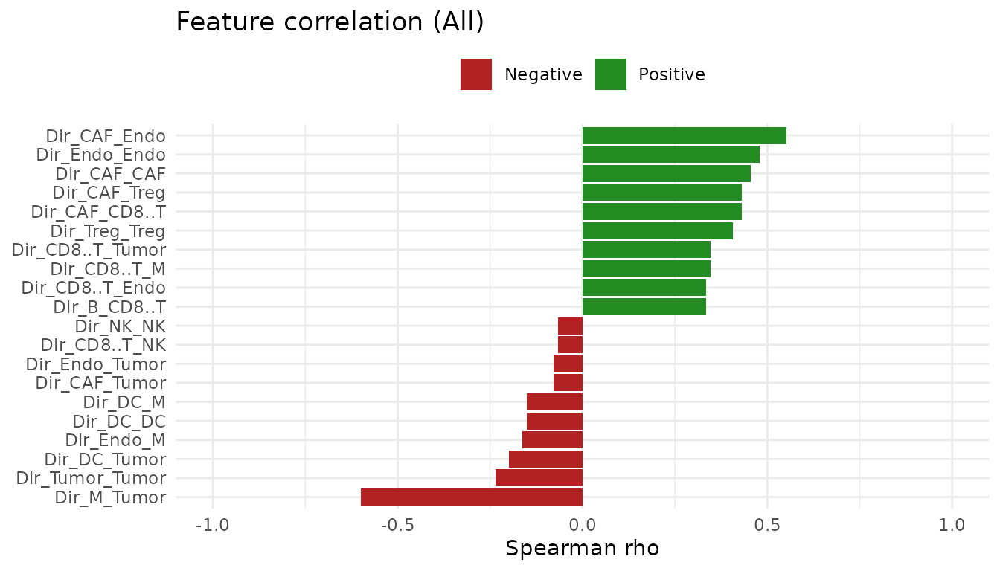

# Getting started with RaCInG

## Overview

`RaCInG` reconstructs patient-specific cell-cell communication networks
from bulk RNA-seq data. The package supports two complementary
workflows:

- a **kernel-based** approach for fast deterministic feature extraction,
  and
- a **Monte Carlo** approach for simulation-based network summaries.

This vignette shows the recommended workflow and the most important
entry points for new users, using both the bundled, ready-made example
data and a real bulk RNA-seq counts matrix run through the full
preprocessing pipeline.

## Installation

### Install from GitHub

``` r

# install.packages("remotes")
remotes::install_github("mhurtado13/racing")
library(RaCInG)
```

### Install from a local checkout

``` r

# install.packages("devtools")
devtools::install(".")
library(RaCInG)
```

If you want to build the RaCInG input matrices directly from raw counts,
install the optional preprocessing dependencies used by
[`prepare_input_files()`](https://mhurtado13.github.io/racing/reference/prepare_input_files.md):

``` r

install.packages(c("ggplot2", "nnls"))
# ADImpute and OmnipathR are available from Bioconductor:
BiocManager::install(c("ADImpute", "OmnipathR"))
# liana and multideconv are GitHub-only:
remotes::install_github(c("saezlab/liana", "VeraPancaldiLab/multideconv"))
```

## Workflow at a glance

| Goal | Function | Output |
|----|----|----|
| Build input matrices from raw counts | [`prepare_input_files()`](https://mhurtado13.github.io/racing/reference/prepare_input_files.md) | Named list with `L`, `R`, `C`, `LR` matrices and labels |
| Compute deterministic features | [`compute_racing_kernel()`](https://mhurtado13.github.io/racing/reference/compute_racing_kernel.md) | Kernel arrays + feature matrix |
| Compute simulation summaries | [`compute_racing_montecarlo()`](https://mhurtado13.github.io/racing/reference/compute_racing_montecarlo.md) | Processed Monte Carlo results |
| Compare clinical groups | [`wilcox_group_test()`](https://mhurtado13.github.io/racing/reference/wilcox_group_test.md) + [`volcano_plot()`](https://mhurtado13.github.io/racing/reference/volcano_plot.md) | Statistics table and volcano plot |
| Relate features to a continuous score | [`correlate_features_with_score()`](https://mhurtado13.github.io/racing/reference/correlate_features_with_score.md) + [`correlation_plot()`](https://mhurtado13.github.io/racing/reference/correlation_plot.md) | Correlation table and rainfall plot |

## How `prepare_input_files()` builds its inputs

Starting from a raw gene-by-sample counts matrix,
[`prepare_input_files()`](https://mhurtado13.github.io/racing/reference/prepare_input_files.md)
chains together several packages so you never have to run them by hand:

1.  **Normalization**: counts are converted to TPM with
    [`ADImpute::NormalizeTPM()`](https://rdrr.io/pkg/ADImpute/man/NormalizeTPM.html).
2.  **Deconvolution**: cell-type fractions are estimated with
    [`multideconv::compute.deconvolution()`](https://rdrr.io/pkg/multideconv/man/compute.deconvolution.html)
    (defaults to the Quantiseq method, but any method(s) supported by
    multideconv can be passed via `deconv_method`).
3.  **Subgroup analysis**:
    [`multideconv::compute.deconvolution.analysis()`](https://rdrr.io/pkg/multideconv/man/compute.deconvolution.analysis.html)
    identifies groups of highly correlated deconvolution features
    (e.g. several methods agreeing on the same cell type) and collapses
    them into a single column per resolved cell type, discarding
    low-quality/high-zero features along the way. Column names are then
    standardized and stripped of any method/signature prefix, giving
    short, consistent cell-type labels (e.g. `"B.cells"`,
    `"CD4.regulatory"`).
4.  **Cell-type expression profiles**: for every gene, a non-negative
    least squares fit of bulk expression against the cell-type fractions
    gives one expression value per gene per resolved cell type.
5.  **Ligand-receptor prior knowledge**: a curated, OmniPath-backed
    consensus network is retrieved with
    [`liana::get_curated_omni()`](https://saezlab.github.io/liana/reference/get_curated_omni.html)
    and restricted to ligand/receptor roles, then decomplexified into
    single-gene subunits.
6.  **Filtering and assembly**: ligand-receptor pairs are kept only
    where both genes are expressed above 10 TPM in the relevant cell
    types, and the `Lmatrix`, `Rmatrix`, `Cmatrix`, and `LRmatrix`
    inputs (see below) are assembled and written to `output_folder`.

You can skip any of steps 2-5 by supplying your own `deconv`,
`cell_expr_profile`, or `cc_network` directly.

## Recommended workflow with a real bulk RNA-seq dataset

The examples below use the raw bulk RNA-seq counts matrix bundled with
the `multideconv` package (`raw_counts`, from Mariathasan et al. 2018, a
urothelial/bladder cancer cohort profiled for anti-PD-L1 response) to
exercise the full pipeline end to end, from raw counts to features to
statistics. These chunks call out to the network (OmniPath/LIANA) and
run real deconvolution, so they are shown but not evaluated when the
vignette is built; run them interactively to try the full pipeline
yourself.

### 1. Build input matrices from raw counts

``` r

data(raw_counts, package = "multideconv")
counts_matrix <- as.matrix(raw_counts)

input <- prepare_input_files(
  counts = counts_matrix,
  output_folder = "Results/",
  file_name = "mariathasan",
  deconv_method = "Quantiseq"
)

str(input, max.level = 1)
input$celltypes
```

### 2. Run the kernel method

The kernel method is the fastest way to derive direct, wedge, triangle,
or GSCC features across patients. You can pass `counts` to let the
function compute inputs automatically, or supply previously computed
matrices via `input_data`.

``` r

# Option A: from raw counts (runs prepare_input_files internally)
kernel_res <- compute_racing_kernel(
  counts = counts_matrix,
  output_folder = tempdir(),
  file_name = "mariathasan",
  communication_type = "W",
  norm = TRUE
)

# Option B: from pre-computed input matrices (skips preprocessing)
kernel_res <- compute_racing_kernel(
  input_data = input,
  communication_type = "W",
  norm = TRUE
)

head(kernel_res$features[, 1:5])
```

### 3. Run the Monte Carlo method

Use the Monte Carlo workflow when you want simulation-based summaries or
uncertainty estimates from repeated graph realizations. The same
`input_data` shortcut is available here. Simulation cost scales with
`Ncells` and `Ngraphs`; the values below are kept small for a quick
illustration.

``` r

set.seed(1)
mc_res <- compute_racing_montecarlo(
  counts = counts_matrix,
  output_folder = tempdir(),
  deconv_method = "Quantiseq",
  file_name = "mariathasan",
  nPatients = 3,
  communication_type = "W",
  Ncells = 100,
  Ngraphs = 10,
  Ndegree = 3,
  norm = TRUE
)

# Or from pre-computed inputs:
mc_res <- compute_racing_montecarlo(
  input_data = input,
  output_folder = tempdir(),
  file_name = "mariathasan",
  communication_type = "W",
  Ncells = 100,
  Ngraphs = 10,
  Ndegree = 3,
  norm = TRUE
)

head(mc_res$output$mean[, 1:5])
```

### 4. Compare clinical groups

Once features are available in a patient-by-feature matrix, use the
built-in Wilcoxon workflow to compare groups.
[`wilcox_group_test()`](https://mhurtado13.github.io/racing/reference/wilcox_group_test.md)
reports, per feature and per pair of groups, the Wilcoxon statistic,
fold change, and (jointly) FDR-adjusted p-value;
[`volcano_plot()`](https://mhurtado13.github.io/racing/reference/volcano_plot.md)
visualizes `log2(fold change)` against significance.

``` r

grouping <- c("Responder", "Responder", "Non-responder", "Non-responder")
wilcox_results <- wilcox_group_test(kernel_res$features, grouping)
head(wilcox_results)
volcano_plot(wilcox_results, top_labels = 15)
```

With more than two groups, every pairwise comparison is run
automatically; subset `wilcox_results` by `Comparison` (or pass a
two-group subset to
[`volcano_plot()`](https://mhurtado13.github.io/racing/reference/volcano_plot.md))
to inspect one pair at a time.

### 5. Correlate features with a continuous score

If you have a continuous per-patient score (e.g. an immune response or
survival score),
[`correlate_features_with_score()`](https://mhurtado13.github.io/racing/reference/correlate_features_with_score.md)
reports the Spearman correlation between every feature and the score,
pooled across all patients and, optionally, within groups.
[`correlation_plot()`](https://mhurtado13.github.io/racing/reference/correlation_plot.md)
shows the top positive and negative correlations.

``` r

response_score <- setNames(rnorm(nrow(kernel_res$features)), rownames(kernel_res$features))
corr_results <- correlate_features_with_score(kernel_res$features, response_score)
head(corr_results)
correlation_plot(corr_results, top_n = 10)
```

## Notes

- [`compute_racing_kernel()`](https://mhurtado13.github.io/racing/reference/compute_racing_kernel.md)
  and
  [`compute_racing_montecarlo()`](https://mhurtado13.github.io/racing/reference/compute_racing_montecarlo.md)
  are the main entry points.
- Both accept an `input_data` argument with pre-computed matrices (as
  returned by
  [`prepare_input_files()`](https://mhurtado13.github.io/racing/reference/prepare_input_files.md)),
  which skips all preprocessing.
- [`prepare_input_files()`](https://mhurtado13.github.io/racing/reference/prepare_input_files.md)
  requires the optional packages listed under Installation for
  deconvolution and prior-network assembly.
- The original Python implementation is available at
  <https://github.com/SysBioOncology/RaCInG>.

## Understanding the input files

RaCInG requires four matrices and associated label vectors that describe
the cell-cell communication landscape for a cohort of patients. The
table below summarises each component:

| Component | Dimensions | Description |
|----|----|----|
| **Lmatrix** | cell types × ligands | Expression weight of each ligand in each cell type. Rows are cell types; columns are ligands. |
| **Rmatrix** | cell types × receptors | Expression weight of each receptor in each cell type. Same row order as `Lmatrix`. |
| **Cmatrix** | patients × cell types | Cell-type fraction for each patient. Each row sums to 1. |
| **LRmatrix** | ligands × receptors × patients | 3-D tensor of ligand–receptor interaction weights. Each patient slice is normalised to sum to 1. |
| **celltypes** | character vector | Alphabetically sorted cell-type names (shared across L, R, and C). |
| **ligands** | character vector | Ligand names matching the columns of `Lmatrix` and the first axis of `LRmatrix`. |
| **receptors** | character vector | Receptor names matching the columns of `Rmatrix` and the second axis of `LRmatrix`. |
| **Sign_matrix** | ligands × receptors | Optional matrix encoding known stimulatory (+1) or inhibitory (−1) interactions. Zeros indicate unknown. |

These inputs are typically generated by
[`prepare_input_files()`](https://mhurtado13.github.io/racing/reference/prepare_input_files.md)
from a raw counts matrix, or they can be assembled manually from
pre-existing deconvolution and prior-network data. The bundled
`skcm_example` dataset provides a ready-made example of this structure.

### Inspecting the example inputs

``` r

library(RaCInG)
data(skcm_example)

# Overall structure
str(skcm_example, max.level = 1)
#> List of 8
#>  $ Lmatrix    : num [1:9, 1:276] 1 0 1 1 1 1 1 1 0 1 ...
#>   ..- attr(*, "dimnames")=List of 2
#>  $ Rmatrix    : num [1:9, 1:298] 1 0 1 1 0 1 1 1 0 0 ...
#>   ..- attr(*, "dimnames")=List of 2
#>  $ Cmatrix    : num [1:10, 1:9] 0.00374 0.01407 0.02119 0 0.00313 ...
#>   ..- attr(*, "dimnames")=List of 2
#>  $ LRmatrix   : num [1:276, 1:298, 1:10] 0.000228 0 0 0 0 ...
#>  $ celltypes  : chr [1:9] "B" "CAF" "CD8+ T" "DC" ...
#>  $ ligands    : chr [1:276] "LGALS9" "ADAM10" "TNFSF12" "ICOSLG" ...
#>  $ receptors  : chr [1:298] "PTPRC" "MET" "CD44" "LRP1" ...
#>  $ Sign_matrix: num [1:276, 1:298] 0 0 0 0 0 0 0 0 0 0 ...
```

``` r

# Lmatrix: 9 cell types × 276 ligands
dim(skcm_example$Lmatrix)
#> [1]   9 276
skcm_example$Lmatrix[1:4, 1:5]
#>      LGALS9 ADAM10 TNFSF12 ICOSLG TNF
#> [1,]      1      1       1      1   1
#> [2,]      0      1       1      0   0
#> [3,]      1      1       1      0   1
#> [4,]      1      1       1      1   1
```

``` r

# Rmatrix: 9 cell types × 298 receptors
dim(skcm_example$Rmatrix)
#> [1]   9 298
skcm_example$Rmatrix[1:4, 1:5]
#>      PTPRC MET CD44 LRP1 CD47
#> [1,]     1   0    1    0    1
#> [2,]     0   1    1    1    1
#> [3,]     1   0    1    0    1
#> [4,]     1   0    1    1    1
```

``` r

# Cmatrix: 10 patients × 9 cell types (rows sum to 1)
dim(skcm_example$Cmatrix)
#> [1] 10  9
skcm_example$Cmatrix[1:4, ]
#>                B         CAF          CD8          DC        Endo         M1
#> [1,] 0.003742534 0.017784413 0.0004763235 0.002384983 0.007165426 0.01515965
#> [2,] 0.014074525 0.019407444 0.0807858943 0.062715975 0.004718812 0.07897314
#> [3,] 0.021190628 0.007153891 0.0166497814 0.012495442 0.012443088 0.03645401
#> [4,] 0.000000000 0.038687885 0.0000000000 0.000942249 0.025184327 0.02306847
#>                NK       Treg     Tumor
#> [1,] 6.110609e-10 0.01089191 0.9423948
#> [2,] 6.783486e-04 0.02023155 0.7184143
#> [3,] 6.351805e-04 0.00000000 0.8929780
#> [4,] 4.680075e-09 0.00000000 0.9121171
```

``` r

# LRmatrix: 276 ligands × 298 receptors × 10 patients (3-D tensor)
dim(skcm_example$LRmatrix)
#> [1] 276 298  10
# First patient slice, top-left corner:
skcm_example$LRmatrix[1:4, 1:4, 1]
#>              [,1]        [,2]        [,3]        [,4]
#> [1,] 0.0002281731 0.001269455 0.001846635 0.001846635
#> [2,] 0.0000000000 0.001269455 0.003174809 0.000000000
#> [3,] 0.0000000000 0.000000000 0.000000000 0.000000000
#> [4,] 0.0000000000 0.000000000 0.000000000 0.000000000
```

``` r

# Label vectors
skcm_example$celltypes
#> [1] "B"      "CAF"    "CD8+ T" "DC"     "Endo"   "M"      "NK"     "Treg"  
#> [9] "Tumor"
head(skcm_example$ligands, 10)
#>  [1] "LGALS9"   "ADAM10"   "TNFSF12"  "ICOSLG"   "TNF"      "HLA.B"   
#>  [7] "HLA.DRA"  "HLA.DQA2" "HLA.DQA1" "HLA.DQB1"
head(skcm_example$receptors, 10)
#>  [1] "PTPRC"   "MET"     "CD44"    "LRP1"    "CD47"    "PTPRK"   "COLEC12"
#>  [8] "HAVCR2"  "MRC2"    "TSPAN15"
```

## Running with the bundled example data

The `skcm_example` list shown above can be passed directly to the kernel
or Monte Carlo workflows via the `input_data` parameter, and to the
statistical analysis functions once features have been computed.

### Kernel method on the example data

``` r

kernel_res <- compute_racing_kernel(
  input_data   = skcm_example,
  output_folder = tempdir(),
  communication_type = "D",
  norm = TRUE
)
#> Using pre-computed input matrices; skipping input generation.
#> Computing kernel for  10  patients
#> Calculating kernel...
#> Calculating features...

head(kernel_res$features[, 1:5])
#>             Dir_B_B Dir_B_CAF Dir_B_CD8..T   Dir_B_DC Dir_B_Endo
#> Patient_1 0.3655633 0.6472004    0.2193690 0.33179690  0.6839505
#> Patient_2 0.7127917 0.5965352    1.0316271 0.84989477  0.6860757
#> Patient_3 1.1609442 0.7959182    0.8781016 0.92070117  0.8362820
#> Patient_4 0.4675364 0.4900159    0.1068774 0.09173062  0.3913845
#> Patient_5 0.2765913 0.5799559    0.1661719 0.37846202  0.4973818
#> Patient_6 0.4209898 0.5559673    0.7787024 0.51126999  0.6621874
```

### Statistical analysis on the example data

``` r

set.seed(1)
grouping <- sample(c("GroupA", "GroupB"), nrow(kernel_res$features), replace = TRUE)
wilcox_results <- wilcox_group_test(kernel_res$features, grouping)
head(wilcox_results)
#>         Comparison      Feature Wilcox_statistic Fold_change      Log2FC
#> 1 GroupA_vs_GroupB      Dir_B_B               15   1.2465145  0.31789965
#> 2 GroupA_vs_GroupB    Dir_B_CAF               17   1.2144863  0.28034627
#> 3 GroupA_vs_GroupB Dir_B_CD8..T               13   1.2607549  0.33428785
#> 4 GroupA_vs_GroupB     Dir_B_DC               12   0.9837813 -0.02359046
#> 5 GroupA_vs_GroupB   Dir_B_Endo               17   1.2748348  0.35031028
#> 6 GroupA_vs_GroupB      Dir_B_M               15   1.0120194  0.01723701
#>     P_value Adjusted_P_value
#> 1 0.6095238                1
#> 2 0.3523810                1
#> 3 0.9142857                1
#> 4 1.0000000                1
#> 5 0.3523810                1
#> 6 0.6095238                1
volcano_plot(wilcox_results, top_labels = 10)
```



``` r

response_score <- setNames(rnorm(nrow(kernel_res$features)), rownames(kernel_res$features))
corr_results <- correlate_features_with_score(kernel_res$features, response_score)
head(corr_results)
#>   Group      Feature       Rho   P_value Adjusted_P_value
#> 1   All    Dir_B_CAF 0.1272727 0.7328868        0.9699973
#> 2   All Dir_B_CD8..T 0.3333333 0.3488462        0.9699973
#> 3   All   Dir_B_Endo 0.2363636 0.5138983        0.9699973
#> 4   All      Dir_B_M 0.1272727 0.7328868        0.9699973
#> 5   All     Dir_B_NK 0.1393939 0.7072038        0.9699973
#> 6   All   Dir_B_Treg 0.2484848 0.4915555        0.9699973
correlation_plot(corr_results, top_n = 10)
```



### Monte Carlo method on the example data

``` r

set.seed(42)
mc_res <- compute_racing_montecarlo(
  input_data   = skcm_example,
  output_folder = tempdir(),
  file_name     = "skcm_example",
  nPatients     = 2,
  communication_type = "W",
  Ncells  = 100,
  Ngraphs = 5,
  Ndegree = 3,
  norm    = TRUE
)
```
